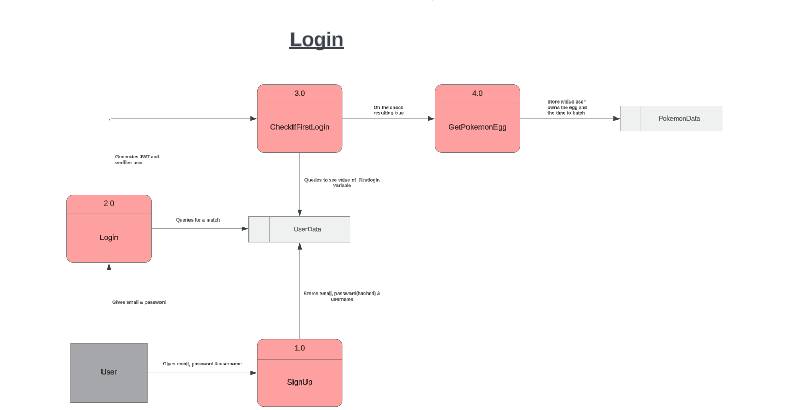

# PokeTrailsDocs

## Official Documentation for the PokéTrails Application

## R1 Description of your website, including

- **Purpose**
  - The purpose of the app/game is to create a casual experience that Pokemon fans, or people just starting to be interested in pokemon, to learn about different pokemon in an enjoyable and engaging way.
- **Features**
  - To choose between two unique character sprites.
  - The ability to hatch a random pokemon.
  - To be able to feed, play and hear the cries of pokemon in the party.
  - To allows players fill out and view their individual pokedex seeing more information about the pokemon the player hatches.
  - To evolve pokemon, seeing the different pokemon forms.
  - To interact with the professor and to buy items from him that improve the progression speed.
  - To buy eggs from the professor which have a random pokemon inside.
  - To donate pokemon the player raises to obtain currency to use in the professors store.
  - A trail system that allows players to send their pokemon on adventures.
  - A trail log that allows players to see what the pokemon is encountering on the trails.
- **Target Audience**
  - As pokemon is a product that is popular with all ages and demographics our target audience will tend to mimic that. The age range that that online pokemon fans tend to be is somewhere between 20-29. As this product is an online application we will be catering to that demographic. While Pokemon fans will be our main target, the game has Gacha mechanics which allow us to appeal to the gacha game player demographic as well.
- **Tech Stack**
  - Javascript
  - NodeJS
  - React
  - ExpressJS
  - Mongoose
  - MongoDB
  - PokeApi
  - Netlify
  - Render

## R2 Dataflow Diagram




## R3 Application Architecture Diagram


## R4 User Stories

### User Personas

In this section, we outline the key user personas and their respective user stories to ensure we cater to their needs and expectations.

### Persona - Pokémon Caretaker


### Persona - Pokémon Enthusuast


### Persona - Pokémon Trainer


### Persona - Pokémon Fan


### User Stories

Below are the detailed user stories for each persona, outlining their needs, motivations, and the desired outcomes. Each story includes specific acceptance criteria to ensure that the implementation meets the user's expectations and provides a satisfying experience. By addressing these user stories, we aim to create a comprehensive and engaging application that resonates with our diverse user base.

```md
As a: Pokémon Caretaker
I want to: play, talk, feed, evolve Pokémon,
So that: I can build a strong bond with my Pokémon, help it grow and evolve
```

**Acceptance Criteria**:

- I can access an interactive screen where I can view stats and interact with my Pokémon.
- Action provides immediate feedback on how it affects my Pokémon's happiness.
- I can play with my Pokémon to increase its happiness.
- I can initiate conversations with my Pokémon and the Pokémon responds with a cry.
- I can feed my Pokémon to increase its happiness.
- I can evolve my Pokémon when the happiness criteria is met.

---

```md
As a: Pokémon Trainer
I want to: send it on trails, collect valuable items.
So that: I can accelerate their evolution.
```

**Acceptance Criteria**:

- I can send my Pokémon on various trails to find items and gain experience.
- Each trail has a different set of potential rewards.
- A timer or progress indicator shows the trail's completion.

---

```md
As a: Pokémon Enthusiast
I want to: Buy Items from Professor's Store and register Pokémon to the Pokédex,:
So that: I can enhance my Pokémon with applied buffs/enhancements and keep track of my Pokémon collection
```

**Acceptance Criteria**:

- I can visit the professor's store to buy items using in-game currency.
- The store updates its inventory regularly.
- The store interface shows available items, their prices, and descriptions.
- I can purchase items and see the updated inventory and currency balance.

---

```md
As a: Pokémon Fan
I want to: receive notifications and alerts for important updates
So that: I can stay informed and engage with the app regularly.
```

**Acceptance Criteria**:

- I can receive in app alerts when my Pokémon returns from a trail, evolves, or needs attention.

---

## R5 Wireframes for multiple standard screen sizes, created using industry standard software

### Sign Up Page Page


### Log In Page


### Main Page


### Party Page


### Trail Menu Page


### Trail Selection Page


### Trail Selection Page (Alt - Pokémon on Trail)


### Pokédex Page


### Store Menu Page


### Store Purchase Page


### Store Upgrade Page


### Store Upgrade Page (Alt - Max Upgraded Item)


### Store Send Pokémon Page


### Store Send Pokémon Page (Alt - Pokémon on Trail)


### User Settings Page


## R6 Screenshots of your Trello board throughout the duration of the project
