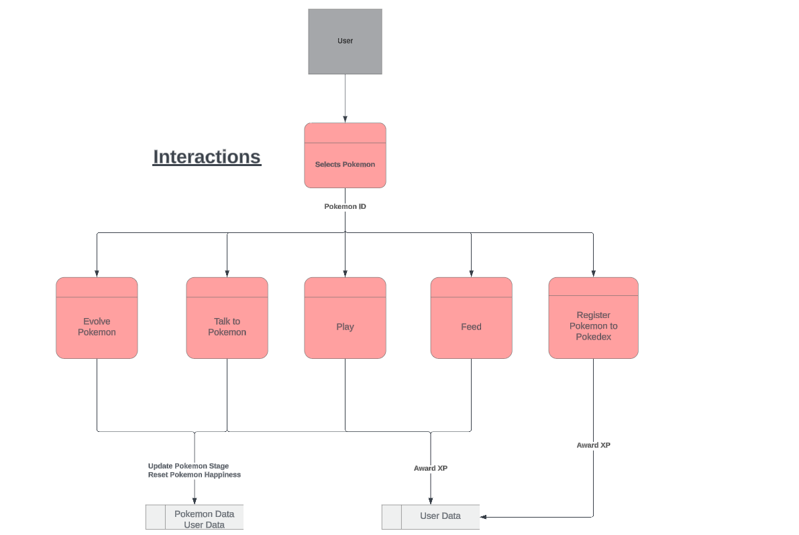

# PokéTrailsDocs

Official Documentation for the PokéTrails Application.

Developed by Rahal Abeyrathna, Suraj Shrestha, Talie Hodge.

## Table of Contents

- [R1 - Application Purpose and Features](#r1---application-purpose-and-features)
  - [Purpose](#purpose)
  - [Features](#features)
  - [Target Audience](#target-audience)
  - [Tech Stack](#tech-stack)
- [R2 - Dataflow Diagrams](#r2---dataflow-diagrams)
- [R3 - Application Architecture Diagram](#r3---application-architecture-diagram)
- [R4 - User Stories and Personas](#r4---user-stories-and-personas)
  - [Persona - Pokémon Caretaker](#persona---pokémon-caretaker)
  - [Persona - Pokémon Enthusiast](#persona---pokémon-enthusiast)
  - [Persona - Pokémon Trainer](#persona---pokémon-trainer)
  - [Persona - Pokémon Fan](#persona---pokémon-fan)
  - [User Stories](#user-stories)
- [R5 -  Mobile, Tablet and Desktop Wireframes](#r5---mobile-tablet-and-desktop-wireframes)
  - [Sign Up Page](#sign-up-page)
  - [Log In Page](#log-in-page)
  - [Main Page](#main-page)
  - [Party Page](#party-page)
  - [Trail Menu Page](#trail-menu-page)
  - [Trail Selection Page](#trail-selection-page)
  - [Trail Selection Page Alt](#trail-selection-page-alt)
  - [Pokédex Page](#pokédex-page)
  - [Store Menu Page](#store-menu-page)
  - [Store Purchase Page](#store-purchase-page)
  - [Store Upgrade Page](#store-upgrade-page)
  - [Store Upgrade Page Alt](#store-upgrade-page-alt)
  - [Store Send Pokémon Page](#store-send-pokémon-page)
  - [Store Send Pokémon Page Alt](#store-send-pokémon-page-alt)
  - [User Settings Page](#user-settings-page)
- [R6 - Trello Board Project Management Screenshots](#r6---trello-board-project-management-screenshots)

## R1 - Application Purpose and Features

### Purpose

The app/game aims to create an enjoyable and engaging experience for both long-time Pokémon fans and newcomers. It provides a fun and casual platform where users can learn about different Pokémon through interactive features and captivating visuals. By exploring various Pokémon species, users can deepen their knowledge and appreciation of the Pokémon universe. The app/game also includes challenges to make the learning process entertaining and rewarding, fostering a community of enthusiastic.

#### Features

Below are the features that we've planned to implement in this applicaiton, including any optional features we would also like to implement given we have enough time.

#### Party Management

- Hatch eggs to receive new Pokémon
- Play, feed and talk to your Pokémon
  - Hear the Pokémon's cry when interacting with it
  - Pokémon has animations and reacts according to interaction user selects
- Evolve Pokémon after raising happiness
- Rename Pokémon with nicknames

#### Trails

- Send Pokémon on specific trails to receive items, egg vouchers and happiness
- View countdown of how long it takes for the Pokémon to complete the trail
- View a log of what the Pokémon is doing on the trail

#### Store

- Purchase in-game buffs to improve progression speed
  - Happiness buffs, increased chance to get egg vouchers etc
- Purchase Eggs using egg vouchers to discover new Pokémon
- Send Pokémon to the Professor to receive currency to use in the store and to fill out the Pokédex
- Talk with the Professor who has new quotes depending on item or Pokémon selected

#### Pokédex

- View Pokémon you have discovered and sent to the Pokémon
- View Pokédex entries with descriptions with Pokémon you have sent to the Professor
- View shiny Pokémon if you have discovered any
- Check overall progress of how far the user has filled out the Pokédex
- View trainer information easily like player level

#### User settings

- Customisation options for user engagement and interaction
  - Custom profile icons and trainer sprites which can be unlocked in store
- View trainer stats and information
- Delete user account if desired

### Target Audience

As Pokémon is a product that is popular with all ages and demographics our target audience will tend to mimic that. The age range that that online Pokémon fans tend to be is somewhere between 20-29. As this product is an online application we will be catering to that demographic. While Pokémon fans will be our main target, the game has Gacha mechanics which allow us to appeal to the gacha game player demographic as well.

### Tech Stack

- **Front End**
  - HTML
  - CSS
  - Javascript
  - React
  - Netlify
  - Tech Domains
- **Back End**
  - Javascript
  - NodeJS
  - ExpressJS
  - Mongoose
  - MongoDB
  - Render
- **Third Party Services**
  - PokéAPI

## R2 - Dataflow Diagrams

The below diagrams depict how data travels, and is stored, throughout various processes present within the application.

### Login Process


### Shop Process


### Trail Process


### Pokémon Interaction Process



## R3 - Application Architecture Diagram

The PokéTrails application leverages a modern web architecture that includes a front-end built with HTML, CSS, JavaScript, and React, hosted on Netlify. The back-end, hosted on Render, utilises Node.js with Express.js and Mongoose for handling API requests and MongoDB operations. The system integrates with third-party services like PokéAPI to enhance functionality and provide comprehensive data to users.

Below is an overview of the full app architecture:


## R4 - User Stories and Personas

In this section, we outline the key user personas and their respective user stories to ensure we cater to their needs and expectations.

### Persona - Pokémon Caretaker


### Persona - Pokémon Enthusiast


### Persona - Pokémon Trainer


### Persona - Pokémon Fan


### User Stories

Below are the detailed user stories for each persona, outlining their needs, motivations, and the desired outcomes. Each story includes specific acceptance criteria to ensure that the implementation meets the user's expectations and provides a satisfying experience. By addressing these user stories, we aim to create a comprehensive and engaging application that resonates with our diverse user base.

```md
As a: Pokémon Caretaker
I want to: play, talk, feed, evolve Pokémon,
So that: I can build a strong bond with my Pokémon, help it grow and evolve
```

**Acceptance Criteria**:

- I can access an interactive screen where I can view stats and interact with my Pokémon.
- Action provides immediate feedback on how it affects my Pokémon's happiness.
- I can play with my Pokémon to increase its happiness.
- I can initiate conversations with my Pokémon and the Pokémon responds with a cry.
- I can feed my Pokémon to increase its happiness.
- I can evolve my Pokémon when the happiness criteria is met.

---

```md
As a: Pokémon Trainer
I want to: send it on trails, collect valuable items.
So that: I can accelerate their evolution.
```

**Acceptance Criteria**:

- I can send my Pokémon on various trails to find items and gain experience.
- Each trail has a different set of potential rewards.
- A timer or progress indicator shows the trail's completion.

---

```md
As a: Pokémon Enthusiast
I want to: Buy Items from Professor's Store and register Pokémon to the Pokédex,:
So that: I can enhance my Pokémon with applied buffs/enhancements and keep track of my Pokémon collection
```

**Acceptance Criteria**:

- I can visit the professor's store to buy items using in-game currency.
- The store updates its inventory regularly.
- The store interface shows available items, their prices, and descriptions.
- I can purchase items and see the updated inventory and currency balance.

---

```md
As a: Pokémon Fan
I want to: receive notifications and alerts for important updates
So that: I can stay informed and engage with the app regularly.
```

**Acceptance Criteria**:

- I can receive in app alerts when my Pokémon returns from a trail, evolves, or needs attention.

---

### User Stories Refinement

Below is an overview of the refinement to the user stories. The user stories were first drafted based on the user personas and further refined after a team discussions and user feedback. The updates include more detailed acceptance criteria and clearer descriptions to better align with user needs and application functionality.

#### What Has Changed

#### Added Acceptance Criteria

- Each user story now includes specific acceptance criteria to clearly define when a user story is complete and meets the requirements.

#### Refined User Stories

- User stories have been rephrased for clarity and better alignment with the intended functionality and user personas.

#### Additional Details for User Interactions

- More details have been provided on how users will interact with the application, ensuring a better understanding of the user experience.

#### Enhanced Specificity

- The user stories now contain more specific information regarding the features and functionalities, reducing ambiguity and aiding in more precise implementation.

#### Change Log


## R5 - Mobile, Tablet and Desktop Wireframes

Below are the wireframes that we developed for this application, consisting of mock ups for Mobile, Tablet and Desktop screens. Annotations can be found on the desktop wireframe for each page, depicting each notable element or component and its function/purpose.

These wireframes were developed and created using Figma, the online version can be viewed and accessed [here](https://www.figma.com/design/l4WFNwF8tMJdNZ5tBWap1D/Pok%C3%A9trails?node-id=935169-448&t=SS62FQ7YuaaWgltJ-1).

### Sign Up Page


### Log In Page


### Main Page


### Party Page


### Trail Menu Page


### Trail Selection Page


### Trail Selection Page Alt


### Pokédex Page


### Store Menu Page


### Store Purchase Page


### Store Upgrade Page


### Store Upgrade Page Alt


### Store Send Pokémon Page


### Store Send Pokémon Page Alt


### User Settings Page


## R6 - Trello Board Project Management Screenshots

### 4/07


### 5/07


### 6/07


### 7/07


### 8/07


### 9/07


### 13/07


### 16/07


### 19/07


