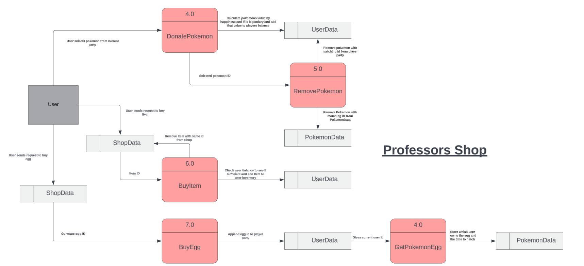

# PokeTrailsDocs

## Official Documentation for the PokéTrails Application

## R1 Description of your website, including

## R2 Dataflow Diagram

## R3 Application Architecture Diagram

## R4 User Stories CMP1043-5.1

## R5 Wireframes for multiple standard screen sizes, created using industry standard software

## R6 Screenshots of your Trello board throughout the duration of the project
